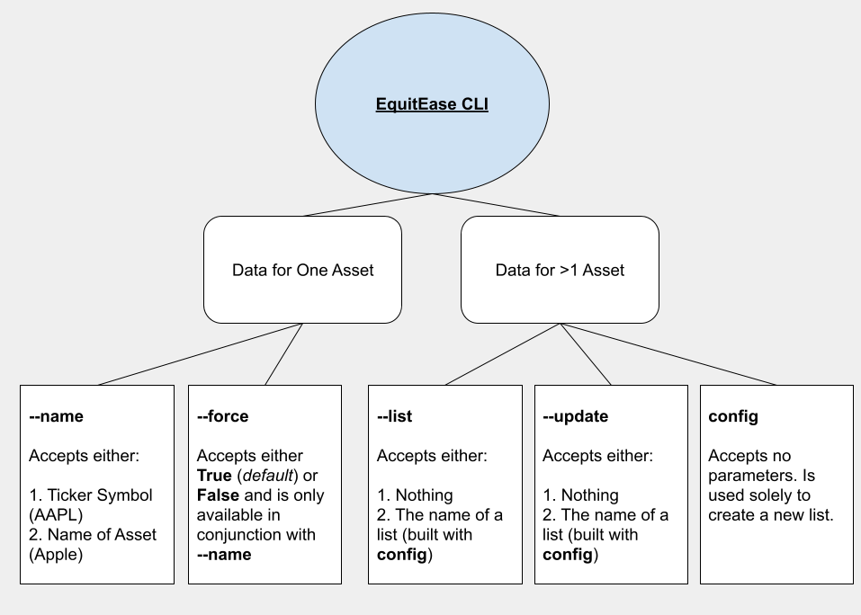

# EquitEase CLI
Access up-to-date data for any of your favorite stocks, cryptocurrencies, and other assets from the command line.


# Table of Contents
- [EquitEase CLI](#equitease-cli)
- [Table of Contents](#table-of-contents)
- [Who is this Project For?](#who-is-this-project-for)
- [Getting Started](#getting-started)
  - [Installation](#installation)
    - [With Brew](#with-brew)
    - [With Pip](#with-pip)
  - [Verifying Installation](#verifying-installation)
- [Exploring the EquitEase CLI](#exploring-the-equitease-cli)
  - [Getting Help](#getting-help)
  - [Get Data for a Single Stock](#get-data-for-a-single-stock)
    - [1. Introducing `--name` [`-n`]](#1-introducing---name--n)
    - [2. Introducing `--force` [`-f`]](#2-introducing---force--f)
  - [Get Data for Numerous Stocks](#get-data-for-numerous-stocks)
    - [1. Introducing `config` (create a list)](#1-introducing-config-create-a-list)
    - [2. Introducing `--update` [`-u`] (update a list)](#2-introducing---update--u-update-a-list)
    - [3. Introducing `--list` [`-l`] (run a list)](#3-introducing---list--l-run-a-list)
  - [Versioning](#versioning)
    - [Introducing `--version` [`-v`]](#introducing---version--v)
- [Questions or Comments?](#questions-or-comments)
  - [Bug Fixes](#bug-fixes)
  - [New Features](#new-features)


# Who is this Project For?
This project is for those who enjoy following day-to-day movements in the market, want to stay up-to-date on the latest price trends, and spend a majority of their time working in the terminal or with their terminal open.

```Note: Throughout this documentation, assets is used as a blanket term which refers to the stocks, options contracts, cryptocurrencies, and other digital assets that can be retrieved with the CLI. Therefore, anytime you see the word assets, know that this is what it is referring stocks, options contracts, crypto, and other digital assets.```
# Getting Started
## Installation
Currently, you can install the CLI with `brew` or `pip`.
### With Brew
Initial Installation:
```shell
>>> brew tap danmurphy1217/equit-ease
>>> brew install danmurphy1217/equit-ease/equit-ease
```
Installing Updates:
```shell
>>> brew tap danmurphy1217/equit-ease
>>> brew upgrade danmurphy1217/equit-ease/equit-ease
```
### With Pip
Initial Installation:
```shell
>>> python3 -m venv venv # setup virtual env...
>>> source venv/bin/activate 
(venv) >>> pip install EquitEase
```
Installing Updates:
```shell
(venv) >>> pip install --upgrade EquitEase
```
## Verifying Installation
```shell
>>> equity --version # or equity -v
```
# Exploring the EquitEase CLI
Here is a basic diagram of the various APIs offered by the EquitEase CLI. The two main buckets are **name** and **list**, which can be used to, respectively, retrieve one *asset* or a list of *assets*.

## Getting Help
When in doubt, the `--help` / `-h` flag will return docs for each argument that is supported by the EquitEase CLI.
```shell
>>> equity --help
positional arguments:
  config
optional arguments:
  -h, --help
    [...]

  --force FORCE, -f FORCE
    [...]

  --name NAME, -n NAME
    [...]

  --list [LIST], -l [LIST]
    [...]

  --update [UPDATE], -u [UPDATE]
    [...]

  --version [VERSION], -v [VERSION]
    [...] 
```
## Get Data for a Single Stock
### 1. Introducing `--name` [`-n`]
The `--name` or `-n` flag allows you to specify the **name** or **ticker symbol** of the *asset* you want to retrieve. Only one ticker symbol may be passed at a time. To get data for Bitcoin, we have one of two options:
1. Use it's "ticker symbol"
```shell
>>> equity --name BTC
--------------------------------------------------------------------------------------------------------------------------------------
 |     Price |       Intra Day Range |    Close |     Open | Market Volume |   Market Cap | Last Earnings Date | Next Dividend Date |
--------------------------------------------------------------------------------------------------------------------------------------
 | 53556.195 | 48967.566 - 57532.312 | 55582.63 | 55582.63 |   90529955840 | 998070943744 |                N/A |                N/A |

 [...] # other data...
```
2. Use it's full name:
```shell
>>> equity --name Bitcoin
--------------------------------------------------------------------------------------------------------------------------------------
 |     Price |       Intra Day Range |    Close |     Open | Market Volume |   Market Cap | Last Earnings Date | Next Dividend Date |
--------------------------------------------------------------------------------------------------------------------------------------
 | 53556.195 | 48967.566 - 57532.312 | 55582.63 | 55582.63 |   90529955840 | 998070943744 |                N/A |                N/A |

 [...] # other data...
```
### 2. Introducing `--force` [`-f`]
Notice how in both scenarios, whether we pass the *actual ticker symbol* or the *full name of the asset*, we get the same result. This is because of the reverse-lookup functionality that is supported by the CLI. Here's a diagram of how this works for **--name** requests with and without the **--force** flag:


First, a user submits a **--name** request through the command line. This request will look like one of the following:
- `equity --name [TICKER or NAME]` (if they want the reverse lookup to choose the ticker symbol)
- `equity --name [TICKER or NAME] --force False` (if they want to choose the ticker symbol)

The former option will suffice 99% of the time. The latter option is useful for looking up:
1. ticker symbols if you know the name of the company/asset but not it's matching ticker or 
2. if you want to get the tickers for option contracts.

Here is a quick example of using **`--force False`**
```shell
>>> equity --name Bitcoin --force False
? Select The Correct Asset: (use arrow keys)
❯ BTC-USD
  BTC-EUR
  BTC-CAD
```
First, you are prompted to select the correct asset. Then, after selecting (in this example we select **BTC-USD**):
```shell
--------------------------------------------------------------------------------------------------------------------------------------
 |     Price |       Intra Day Range |    Close |     Open | Market Volume |   Market Cap | Last Earnings Date | Next Dividend Date |
--------------------------------------------------------------------------------------------------------------------------------------
 | 53556.195 | 48967.566 - 57532.312 | 55582.63 | 55582.63 |   90529955840 | 998070943744 |                N/A |                N/A |

 [...] # other data...
```
The same result is displayed:smile:
...
## Get Data for Numerous Stocks
Now, let's say you have a list of stocks you like to regularly check. Maybe this is your own personal portfolio or stocks you want to keep an eye on. This is where the **--list** flag comes in handy. You can **create** lists, **update** them, and **run** them.
### 1. Introducing `config` (create a list)
- Templatized Example
```shell
>>> equity config
? List Name: [ENTER LIST NAME HERE]
? Equities to include in list: [COMMA-SEPARATED TICKER SYMBOLS OR ASSET NAMES]
```
- Actual Example
```shell
>>> equity config
? List Name: Test
? Equities to include in list: CRM,Bitcoin,MSFT,Apple,GOEV,Algorand # not investment advice😉
```
### 2. Introducing `--update` [`-u`] (update a list)
- If your portfolio or the stocks you want to track change
```shell
>>> equity --update [LIST NAME] # specify list name
>>> equity --update # specify no name and choose from dropdown
? Select The List You Want To Update:  (Use arrow keys)
❯ Test
  List Two
```
As shown in the above code, you can run `equity --update` with or without a list name. If you don't specify a name, you will be prompted to choose which one to update. Once you specify a list (in the entrypoint or from the dropdown), you will be prompted with an interface similar to the following:
```shell
? Select The List You Want To Update:  Test
? Edit The List:  CRM,Bitcoin,MSFT,Apple,GOEV,Algorand,Dogecoin # Add Dogecoin
```
### 3. Introducing `--list` [`-l`] (run a list)
To run a list, you can use either of the following:
```shell
>>> equity --list [LIST NAME] # specify list name
>>> equity --list # specify no name and choose from dropdown
```
Similarly to **--update**, you can specify a list name or leave it blank. If you leave it blank, you will be prompted to choose the list you want to run.
## Versioning
### Introducing `--version` [`-v`]
A simple way to check that you're running the latest version of the CLI:smile:
```shell
equity-cli/A.B.C Python/3.9.0
```
# Questions or Comments?
## Bug Fixes
If you run into an issue, please open a PR. In the PR, please describe:
1. The desired functionality (what did you expect to happen?)
2. The outcome (what actually happened?)
3. Any error messages or code that you were running
## New Features
If you want a new feature to be added, please open up a PR with:
1. a generic description of the desired functionality (what do you want to do with the EquitEase CLI that it does not currently support?)